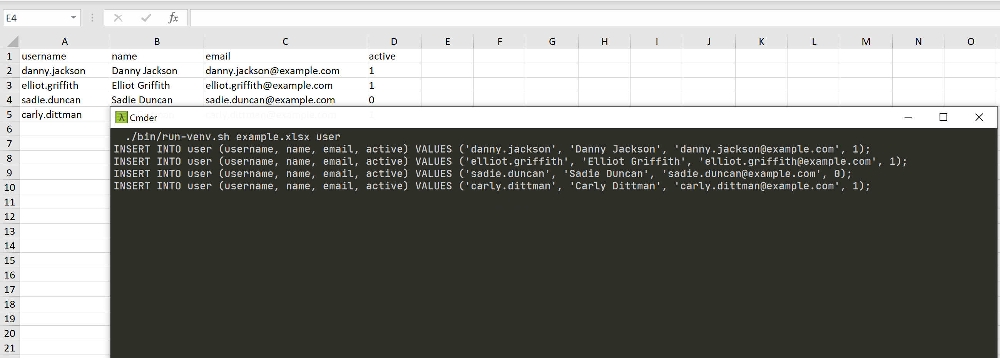

# Excel to MySQL Generator

The tool is used to generate MySQL queries to add or update data based on an Excel spreadsheet.



## Usage

```commandline
usage: main.py [-h] [--statement STATEMENT] [--postfix POSTFIX] xlsx table

Generate MySQL queries based on input data

positional arguments:
  xlsx                  Path to the XLSX file containing the input data
  table                 The name of the table in the database

optional arguments:
  -h, --help            show this help message and exit
  --statement STATEMENT
                        Statement (insert or update)
  --postfix POSTFIX     The content of the postfix that will be added to each generated query
```

## Installation

The module uses additional packages that must be installed with the package installer for Python. To do this, run the command:

```commandline
pip install -r requirements.txt
```

or by using the make utility:

```commandline
make install
```

## Running the module

```commandline
python main.py example.xlsx users
python main.py example.xlsx users --statement update --postfix "WHERE id = 10"
```

## Virtual environment

The venv module provides support for creating "virtual environments" with your own independent set of Python packages. In order to prepare a virtual environment, we must first create it and then connect to it:

```commandline
python -m venv ./venv && source ./venv/Scripts/activate
```

or by using the make utility:

```commandline
make venv
```

**Instead of installing packages globally, we can only install them in a created virtual environment.**

In order to run the module with automatic connection to the virtual environment, the ``bin/run-venv.sh`` file has been prepared. Just run the command in the console:

```commandline
bin/run-venv.sh example.xlsx users
```

## License

MIT
